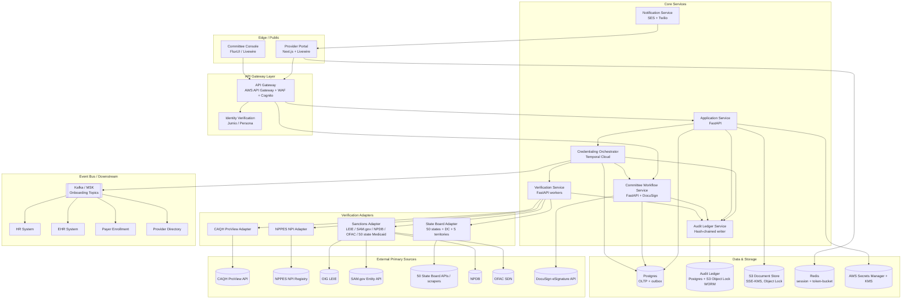
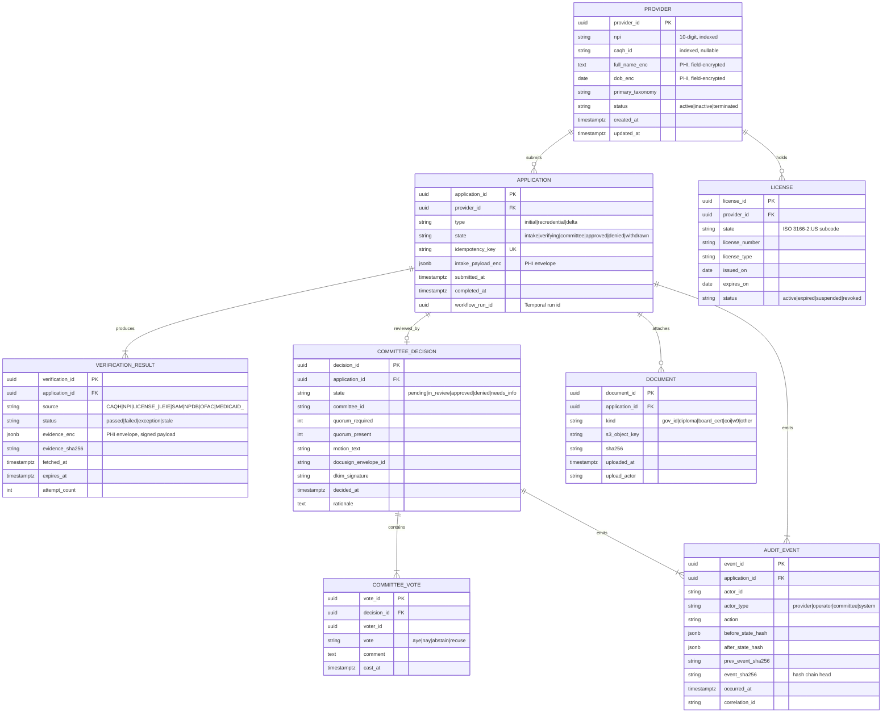
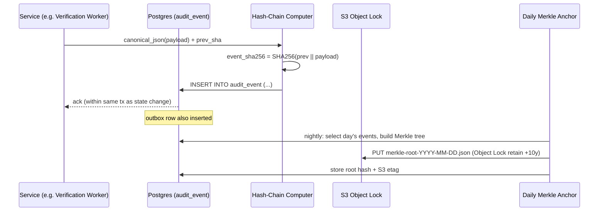

# Healthcare Provider Credentialing System — System Architecture

**Document ID:** HCPC-ARCH-001
**Version:** 1.0.0
**Status:** Proposed (M2 baseline)
**Owner:** Senior Developer
**Last Updated:** 2026-06-13
**Related:** HCPC-CHARTER-001, ADR-001 (Orchestration Engine)

---

## 1. Overview

This document defines the baseline architecture for the Healthcare Provider Credentialing (HCPC) system. It implements the seven-step workflow from the charter (S1–S7) under the constraints of HIPAA, CMS Conditions of Participation, NCQA CR, URAC, and SOC 2 Type II. The architecture is built around four guiding principles:

1. **Audit-first.** Every state transition is durable, timestamped, hash-chained, and replayable.
2. **PHI-minimizing.** PHI is encrypted at rest with field-level keys, redacted from logs, and never leaves US-region infrastructure.
3. **External-failure-tolerant.** All primary-source verifications (CAQH, NPPES, state boards, LEIE, SAM.gov, NPDB, OFAC) are wrapped in retry/circuit-breaker policies with documented manual fallbacks.
4. **Human-in-the-loop where it matters.** Committee approval is a first-class workflow stage with structured voting, quorum logic, and DocuSign + DKIM-signed evidence.

---

## 2. Component Diagram



### 2.1 ASCII Variant (committed alongside Mermaid per docs convention)

```
+------------------+      +------------------+
| Provider Portal  |      | Committee Console|
+--------+---------+      +---------+--------+
         |                          |
         v                          v
   +-----+--------------------------+-----+
   |        API Gateway (WAF, Cognito)    |
   +-----+--------------------------+-----+
         |                          |
         v                          v
+--------+---------+        +-------+--------+
| Application Svc  |        | Committee Svc  |
+--------+---------+        +-------+--------+
         |                          |
         +----------+    +----------+
                    v    v
            +-------+----+--------+
            | Credentialing       |
            | Orchestrator        |
            | (Temporal)          |
            +-+-----+-----+-----+-+
              |     |     |     |
              v     v     v     v
           CAQH   NPI  License Sanctions
              \    |     |     /
               v   v     v    v
        +------+---+-----+----+-----+
        |   External Primary Sources |
        +----------------------------+
                    |
                    v
          +---------+----------+
          |  Audit Ledger      |
          |  (hash-chained,    |
          |   WORM S3 mirror)  |
          +---------+----------+
                    |
                    v
          +---------+----------+
          | Kafka Event Bus    |
          | -> HR, EHR, Payer, |
          |    Directory       |
          +--------------------+
```

---

## 3. Data Model

All PHI columns are encrypted with KMS-backed envelope encryption (per-field DEKs wrapped by a CMK with rotation). `provider_id` is a stable UUIDv7 used across all systems for correlation.

### 3.1 Entities and Key Fields



### 3.2 Field Notes

- **Hash chain.** `AUDIT_EVENT.event_sha256 = SHA256(prev_event_sha256 || canonical_json(payload))`. Genesis event per application is anchored to a daily organization-wide root hash stored in a separate ledger table and mirrored to S3 Object Lock (governance mode, retain-until +10 years).
- **Idempotency keys.** Every external write (CAQH refresh, DocuSign envelope creation, Kafka emit) carries `application_id:step:attempt` as the idempotency key.
- **PHI envelopes.** `*_enc` columns store `{ciphertext, dek_id, iv, aad}` with KMS-wrapped DEKs; AAD includes `application_id` and column name to bind ciphertext to context.
- **Soft delete is forbidden** on Provider, Application, VerificationResult, CommitteeDecision, AuditEvent. State transitions only.

---

## 4. API Surface

OpenAPI 3.1 spec lives at `architecture/api/openapi.yaml` (to be authored at M2 close). Below is the summary.

### 4.1 REST Endpoints

| Method | Path | Auth | Purpose |
|---|---|---|---|
| `POST` | `/v1/applications` | Provider OAuth (Cognito) | Create application; returns `application_id`, `workflow_run_id`. Body includes `idempotency_key`. |
| `GET` | `/v1/applications/{id}` | Provider or Operator | Status, current step, last verification snapshot. |
| `POST` | `/v1/applications/{id}/documents` | Provider | Multipart upload (gov ID, diploma, etc.); server-side virus scan; returns `document_id`. |
| `POST` | `/v1/applications/{id}/identity` | Provider | Submit identity verification result from Jumio/Persona webhook. |
| `POST` | `/v1/applications/{id}/withdraw` | Provider | Withdraw before committee. |
| `GET` | `/v1/applications/{id}/verifications` | Operator | List all verification results. |
| `POST` | `/v1/applications/{id}/verifications/{source}/retry` | Operator | Manual retry of a failed source. |
| `GET` | `/v1/committee/queue` | Committee member | Files ready for review. |
| `POST` | `/v1/committee/decisions/{id}/vote` | Committee member | Cast vote (aye/nay/abstain/recuse). |
| `POST` | `/v1/committee/decisions/{id}/finalize` | Committee chair | Close vote, create DocuSign envelope. |
| `GET` | `/v1/audit/applications/{id}/events` | Operator/Auditor | Hash-chained event list, paginated. |
| `GET` | `/v1/audit/applications/{id}/verify-chain` | Auditor | Returns chain validity proof. |
| `POST` | `/v1/webhooks/docusign` | DocuSign HMAC | Envelope status callbacks. |
| `POST` | `/v1/webhooks/identity` | Vendor HMAC | Identity verification callbacks. |

All responses include `correlation_id` header for tracing through Temporal + Kafka.

### 4.2 Event Payloads (AsyncAPI 2.6)

Topic naming: `credentialing.<entity>.<event>.v<schema_version>`. JSON Schema enforced by Confluent Schema Registry. Every payload includes `correlation_id`, `application_id`, `occurred_at` (RFC 3339), and `producer_version`.

**`credentialing.application.submitted.v1`**
```json
{
  "application_id": "uuid",
  "provider_id": "uuid",
  "type": "initial|recredential",
  "submitted_at": "RFC3339",
  "correlation_id": "uuid"
}
```

**`credentialing.verification.completed.v1`**
```json
{
  "application_id": "uuid",
  "source": "CAQH|NPI|LICENSE_CA|LEIE|...",
  "status": "passed|failed|exception|stale",
  "evidence_sha256": "hex",
  "completed_at": "RFC3339",
  "correlation_id": "uuid"
}
```

**`credentialing.committee.decided.v1`**
```json
{
  "application_id": "uuid",
  "decision_id": "uuid",
  "outcome": "approved|denied|needs_info",
  "quorum_present": 7,
  "quorum_required": 5,
  "docusign_envelope_id": "string",
  "dkim_signature": "base64",
  "decided_at": "RFC3339",
  "correlation_id": "uuid"
}
```

**`credentialing.provider.onboarding_requested.v1`** (S7 fan-out)
```json
{
  "provider_id": "uuid",
  "application_id": "uuid",
  "effective_date": "YYYY-MM-DD",
  "network_ids": ["medicare_advantage", "commercial_ppo"],
  "downstream_targets": ["hr", "ehr", "payer_enrollment", "directory"],
  "correlation_id": "uuid"
}
```

Producer uses the **transactional outbox pattern**: a row in `outbox_events` is written in the same DB transaction as the state change; a Debezium connector ships rows to Kafka with at-least-once guarantees. Consumers must be idempotent (keyed by `event_id`).

---

## 5. Integration Points

| Source | Type | Protocol | Auth | Freshness SLA | Criticality |
|---|---|---|---|---|---|
| CAQH ProView | Primary profile source | REST/JSON | OAuth2 client creds + IP allowlist | 24 h cache TTL; delta polling | **Critical** |
| NPPES NPI Registry | Government registry | REST/JSON (public) | None (rate-limited by IP) | 24 h | **Critical** |
| OIG LEIE | Exclusion list | CSV download + REST search | None | Monthly refresh (LEIE cadence) | **Critical** |
| SAM.gov Entity API | Federal exclusion | REST/JSON | API key | Daily | **Critical** |
| NPDB | Practitioner data bank | REST + queryDocument | X.509 mutual TLS | Per-query | High |
| OFAC SDN | Sanctions | XML/CSV download | None | Daily | High |
| 50 State Boards | License verification | Mixed: REST API where available, sanctioned scrape otherwise | Per-state | Per-state contract | **Critical** |
| 50 State Medicaid Exclusions | Per-state exclusion | Mostly CSV/HTML | Per-state | Weekly | High |
| DocuSign eSignature | Signature collection | REST + Connect webhooks | JWT grant | Real-time | High |
| Jumio / Persona | Identity verification | REST + webhooks | API key + HMAC | Real-time | High |
| Kafka (MSK) | Internal event bus | Kafka protocol | mTLS + ACLs | Real-time | **Critical** |

Adapter contract: each integration is a `VerifierAdapter` implementing `fetch(provider_ref) -> EvidenceEnvelope` and `health() -> AdapterHealth`. Adapters are unit-tested with recorded fixtures and contract-tested with replay harnesses.

---

## 6. Tech Stack Recommendation

| Layer | Choice | Justification |
|---|---|---|
| **Language (backend)** | Python 3.12 (FastAPI) for verification services and orchestrator workers; TypeScript (NestJS) reserved for portal BFF | Python ecosystem dominates healthcare SDKs (NPPES, LEIE, NPDB clients exist); FastAPI gives native async + Pydantic v2 schema enforcement. Team standardization documented in ADR-002. |
| **Frontend** | Laravel + Livewire + FluxUI (provider portal, committee console) | Aligns with platform standard; Livewire real-time updates suit status portal; FluxUI gives accessibility-compliant components out of box. |
| **Orchestration** | **Temporal Cloud (US-region)** | Durable execution, native retry policies, signals/queries for human-in-loop committee step, per-activity timeout policies, deterministic replay for audit. Justified in ADR-001. AWS Step Functions evaluated as runner-up. |
| **OLTP DB** | Amazon RDS Postgres 16 (Multi-AZ, encrypted, IAM auth) | Strong consistency for application state and outbox; JSONB for evidence; logical replication to read replicas for reporting; PITR. |
| **Audit Ledger** | Postgres append-only table + S3 Object Lock (governance) mirror via daily Merkle root | Postgres for query speed; S3 Object Lock provides WORM compliance and tamper evidence required for NCQA/CMS. QLDB considered but its phased deprecation makes it untenable. |
| **Document store** | S3 with SSE-KMS, Object Lock for finalized files, lifecycle to Glacier after 7 years | HIPAA-ready, encryption with customer-managed CMK. |
| **Secrets / Keys** | AWS Secrets Manager + KMS CMK per env, rotation 90 days | PHI envelope encryption via DEK/CMK. |
| **Event Bus** | Amazon MSK (Kafka) + Confluent Schema Registry + Debezium outbox connector | Already operational per charter assumption; transactional outbox prevents dual-write divergence. |
| **Caching / Rate limiting** | ElastiCache Redis (cluster mode) | Token-bucket for CAQH calls, session cache, idempotency dedupe. |
| **Identity (workforce)** | AWS Cognito + Okta SSO for committee members | MFA, SAML, fine-grained scopes. |
| **Identity (providers)** | Cognito user pool + WebAuthn | Phishing-resistant MFA for high-risk role. |
| **Identity verification** | Jumio (primary), Persona (alt; ET-tracked bake-off) | Both BAA-ready; bake-off owned by ExperimentTracker. |
| **eSignature** | DocuSign with HIPAA BAA + custom DKIM-signed audit envelope | Charter assumption; DKIM duplicate provides cryptographic backup independent of vendor. |
| **Observability** | OpenTelemetry → Honeycomb + Prometheus + Grafana; PII-redacted logs to CloudWatch Logs + S3 | OTEL traces span Temporal + FastAPI + Kafka; PHI redaction middleware enforced at the logging-handler level. |
| **CI/CD** | GitHub Actions + AWS CodeDeploy; signed artifacts; SBOM via Syft | Standardized; SBOM is SOC2 evidence. |
| **IaC** | Terraform (modules per service) + Terragrunt for env composition | Versioned infra, drift detection in CI. |
| **Test** | pytest + Schemathesis (OpenAPI) + WireMock (external sources) + Pact (contracts) | Fixture replay harness per external source supports R1/R2 mitigation. |

---

## 7. Audit Trail Design

### 7.1 Goals (mapped to QG-1)

- Immutable: no UPDATE, no DELETE — append-only with DB-level revocation of those grants for the service role.
- Tamper-evident: SHA-256 hash chain per application, daily organizational Merkle root.
- Replayable: state at any past moment can be reconstructed from the chain plus snapshots.
- Long-retention: 10-year minimum, WORM-locked.

### 7.2 Write Path



### 7.3 Tamper-Evidence Properties

- **Per-event chain:** any modification of an event changes its hash, breaking the chain at the next event.
- **Daily Merkle root** stored under S3 Object Lock with governance retention prevents both internal admin tampering and storage-level rewrites.
- **External attestation** (quarterly): submit the previous quarter's daily root hashes to a third-party timestamping authority (RFC 3161); attestation receipts archived alongside roots.
- **Separation of duties:** the `audit_writer` DB role has `INSERT` only; `audit_reader` (for verification) has `SELECT` only; no role has UPDATE/DELETE in any environment.

### 7.4 Verification API

`GET /v1/audit/applications/{id}/verify-chain` returns:

```json
{
  "application_id": "uuid",
  "event_count": 42,
  "first_event_sha": "...",
  "last_event_sha": "...",
  "is_chain_intact": true,
  "linked_daily_roots": ["YYYY-MM-DD", ...],
  "external_anchor_proofs": [...]
}
```

---

## 8. Failure Modes and Resilience Strategy

Strategies are mapped to the workflow steps and to the risks R1, R2, R7 in the charter.

### 8.1 Generic Patterns

- **Retry with exponential backoff + jitter:** baseline policy on all activities (initial 1 s, max 60 s, max 5 attempts) unless overridden.
- **Circuit breaker (per adapter):** half-open after 30 s; opens on 5 consecutive failures or >25% error rate over 60 s window; opens to a fallback ("manual review queue").
- **Bulkhead:** each adapter has its own worker pool (Temporal task queue) so a slow state-board adapter cannot starve CAQH.
- **Idempotency:** every external write keyed by `application_id:step:attempt`; receivers MUST dedupe.
- **Dead-letter queue:** Kafka DLQ topic per consumer group with redrive tooling.
- **Stale detection:** verification results with `now > expires_at` are auto-marked `stale`; S7 will not run with any `stale` artifact (R4 mitigation).

### 8.2 Per-Integration Failure Matrix

| Step | Source | Retry policy | Circuit-breaker fallback | Manual recovery |
|---|---|---|---|---|
| S2 | CAQH ProView | 5 attempts, exp backoff to 60 s, retry on 5xx + 429 | Manual lookup runbook; operator pastes CAQH PDF, fingerprint stored | Daily cached snapshot replication (R1) |
| S3 | State Board API (per state) | 8 attempts, exp backoff to 5 min, retry on transient + DNS | Switch to scraper variant; if both fail, manual primary-source verification queue | Per-state runbook; legal-reviewed allowlist (R2) |
| S3 | State Board scraper (per state) | 3 attempts; schema-drift detection blocks retry | Fall through to operator queue; alert on schema drift within 5 min | Hot-swap to manual PSV |
| S4 | OIG LEIE | 5 attempts; download retried on partial | Use last good snapshot if <2x SLA stale; block S7 if >2x | Reconciliation job weekly |
| S4 | SAM.gov | 5 attempts; respect 429 Retry-After | Daily snapshot fallback | Manual re-run |
| S4 | NPDB | 3 attempts; mTLS failures alert SecOps immediately | Open ticket; do not bypass | Manual query via NPDB portal, evidence uploaded |
| S4 | OFAC SDN | 5 attempts | Cached daily snapshot | Manual review |
| S4 | State Medicaid (per state) | 5 attempts | Last good snapshot if <14 days; otherwise manual queue | Weekly reconciliation |
| S5 | NPPES NPI | 5 attempts, exp backoff to 30 s | Cached snapshot (NPPES has weekly bulk dump) | Manual portal lookup |
| S6 | DocuSign | 5 attempts on envelope create; webhook reconciler on connect failures | DKIM-signed in-house envelope as backup | Reconciler job hourly |
| S7 | Kafka emit | Outbox + Debezium guarantee at-least-once; consumer retries 3x then DLQ | DLQ + drift report | Replay tool per topic (R7) |

### 8.3 Workflow-Level Compensation

Temporal workflow uses **saga-style compensation** only where state is externally visible. The two relevant cases:

- **S7 partial fan-out failure** (e.g., HR ack but EHR DLQ): compensation is "do not retract"; instead emit `credentialing.provider.onboarding_partial.v1` and trigger reconciliation. Provider is still credentialed; downstream resync is a separate concern.
- **Committee approval rescinded post-decision** (extremely rare): triggers a `credentialing.provider.deactivation_requested.v1` event and audit-ledger annotation; no rewrite of prior approval event.

### 8.4 SLO Summary

| Service | Availability SLO | Latency p95 | Error budget burn alert |
|---|---|---|---|
| Provider Portal | 99.9% | 2 s | 2% over 1 h |
| Committee Console | 99.5% | 2 s | 5% over 1 h |
| Verification activities | n/a (async) | 15 min per source p95 | Queue depth > 100, age > 30 min |
| Audit ledger write | 99.99% | 200 ms | any failure pages SRE |
| Kafka emit (outbox -> topic) | 99.99% delivery | 5 s p95 | >0.01% gap |

---

## 9. Security & Compliance Hooks

- **PHI classification map** lives at `compliance/data-classification.md`; every field tagged.
- **Threat model** (STRIDE) at `architecture/threat-model.md`; updated at M2, M5, M9.
- **Data residency:** all infra in `us-east-1` and `us-west-2`; cross-region replication uses customer-managed KMS keys.
- **Logging:** PHI redaction is a structlog processor mandated by `logging.py` shared lib; CI test verifies no PHI tokens leak.
- **Access reviews:** quarterly via AWS IAM Access Analyzer + manual sign-off; evidence archived for SOC2.
- **Vendor BAAs:** CAQH, DocuSign, Jumio/Persona, AWS — all tracked in `compliance/baas/`.

---

## 10. Open Questions & Follow-up ADRs

| ID | Topic | Target |
|---|---|---|
| ADR-001 | Orchestration engine (Temporal vs Step Functions vs custom) | This batch |
| ADR-002 | Service language standardization (Python/FastAPI primary) | M2 |
| ADR-003 | Audit ledger storage (Postgres+S3 vs QLDB vs blockchain) | M2 |
| ADR-004 | Identity verification vendor (Jumio vs Persona bake-off outcome) | M3 (ET-led) |
| ADR-005 | State-board adapter strategy (per-state runbooks, scraper allowlist) | M6 |

---

*End of Architecture Baseline v1.0.0*
